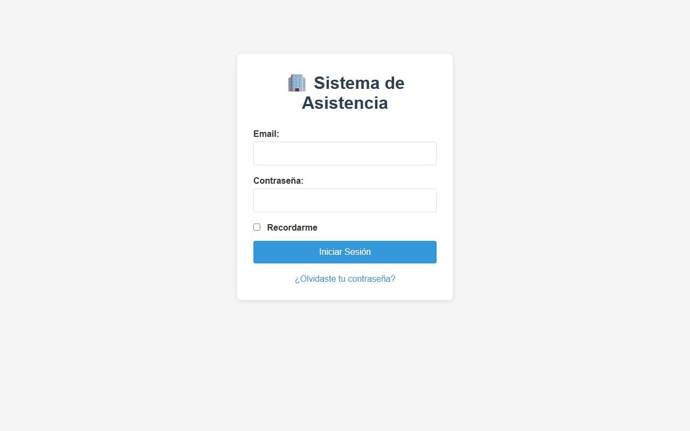
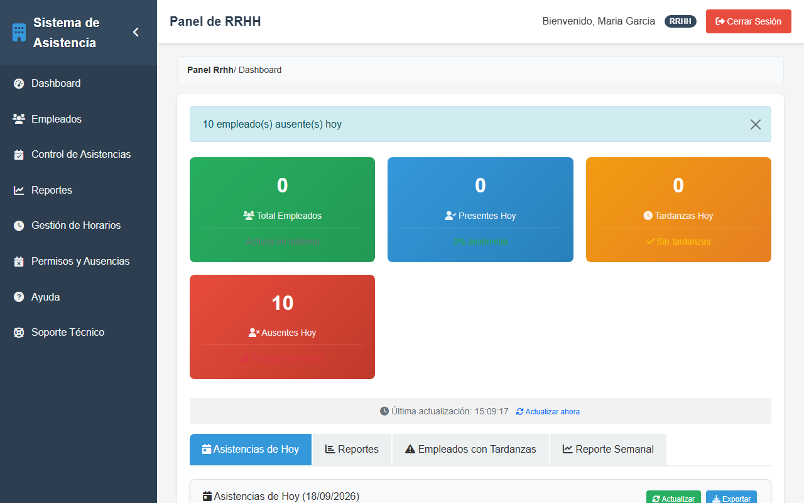
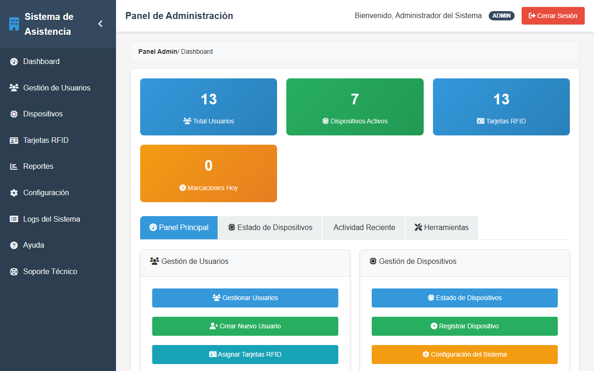
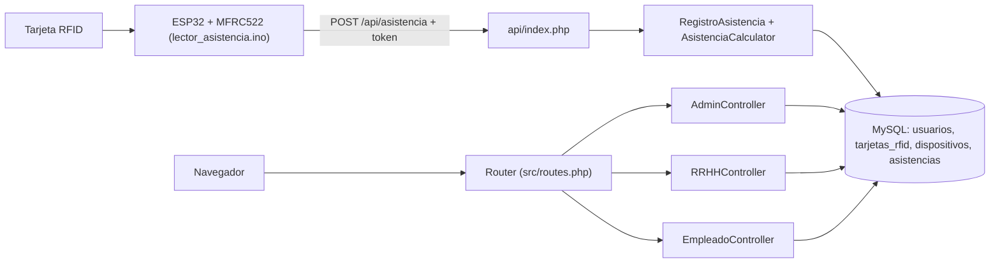

<div align="center">
  
  <h1>PresenteYa</h1>
  <p><b>Control de asistencia por tarjeta RFID: lector ESP32 en la puerta y panel web PHP + MySQL por roles.</b></p>

  
  
  
  
  
  
  <br />
  <a href="https://github.com/Luiss2080/PresenteYa/actions/workflows/ci.yml"></a>

  <p>
    <a href="#-inicio-rápido">Inicio rápido</a> ·
    <a href="#-características">Características</a> ·
    <a href="#-arquitectura">Arquitectura</a> ·
    <a href="#-pruebas">Pruebas</a> ·
    <a href="#-lo-que-todavía-no-existe">Limitaciones</a>
  </p>
</div>

PresenteYa registra entradas y salidas de empleados con tarjetas RFID: un lector **ESP32 + MFRC522** envía el
UID a una API en PHP, que calcula tardanzas según el horario de cada empleado, y un panel web muestra a
administración, RRHH y empleados solo lo que les corresponde. Es un MVP hecho a mano (sin framework) que **no**
es un producto listo para producción: revisa las [limitaciones](#-lo-que-todavía-no-existe) antes de usarlo.

## 🎬 Vista rápida

Capturas reales con datos de ejemplo del volcado incluido (base temporal, contraseñas de demostración):

| Login | Panel de RRHH |
|---|---|
|  |  |



Flujo principal:

```text
Tarjeta RFID -> lector ESP32 (LED/buzzer) -> POST /api/asistencia con token del dispositivo
   -> RegistroAsistencia calcula entrada/salida y tardanza -> MySQL
   -> RRHH ve presentes/tardanzas/ausentes; el empleado ve su historial
```

## ✨ Características

| Característica | Detalle |
|---|---|
| 🏷️ Marcación RFID | El ESP32 lee el UID y lo envía a la API; el backend decide entrada o salida y si hubo tardanza (`RegistroAsistencia`, `AsistenciaCalculator`). |
| 📡 Modo offline en firmware | Si no hay WiFi o servidor, las marcaciones se guardan en memoria (`Preferences`) y se reenvían (`enviarAsistenciasOffline()`). |
| 👥 Tres roles | Administrador (usuarios, dispositivos, tarjetas), RRHH (dashboard del día, alertas, reportes) y Empleado (su historial). |
| 🔑 Token por dispositivo | Cada lector envía su token en cada petición; la API lo valida contra `dispositivos.token_dispositivo` (excepto `ping`). |
| 🔐 Login | Sesión PHP, `password_hash`/`password_verify`, `session_regenerate_id` y CSRF en formularios que modifican datos. |
| 🚨 Alertas | Tardanzas consecutivas (3 días), ausencias, dispositivos desconectados y marcaciones sospechosas (misma tarjeta en dos lectores). |
| 📊 Reportes | Por rango de fechas y empleado; exportación en HTML servido como Excel/PDF (no son archivos reales). |
| 🛡️ Anti-rebote | El servidor rechaza una segunda marcación del mismo usuario en menos de 5 minutos. |

## 🏗️ Arquitectura



<details>
<summary>📁 Estructura de carpetas</summary>

```
api/index.php        API para el ESP32 (ping, asistencia, configuracion, sincronizar, estado)
app/Controllers/     Auth, Admin, RRHH, Empleado
app/Models/          Database, Usuario, Dispositivo, TarjetaRFID, RegistroAsistencia, Reporte
app/Utils/           Auth, AsistenciaCalculator, Response, Validator
app/Views/           admin, rrhh, empleado, auth, layouts
config/              app, database, bootstrap (lee .env)
database/            backup_completo.sql (esquema + datos de ejemplo)
esp32/               lector_asistencia.ino, config.h.example, README y diagrama de conexiones
src/routes.php       Router propio
tests/               PHPUnit (unit) y SystemTest.php (script manual)
```

</details>

## 🚀 Inicio rápido

| Requisito | Versión |
|---|---|
| PHP | 8.0+ con `pdo_mysql` |
| MySQL / MariaDB | 5.7+ |
| Servidor web | Apache con `mod_rewrite` (Laragon/XAMPP) bajo `/ControlDeAsistencia/` |
| ESP32 + MFRC522 | Opcional; para el lector (ver `esp32/README.md`) |

```bash
git clone https://github.com/Luiss2080/PresenteYa.git ControlDeAsistencia   # el nombre de carpeta importa
cd ControlDeAsistencia
composer install
cp .env.example .env            # edita DB_NAME, DB_USER, DB_PASS
mysql -u root -e "CREATE DATABASE control_asistencia CHARACTER SET utf8mb4"
mysql -u root control_asistencia < database/backup_completo.sql
```

Coloca la carpeta como `ControlDeAsistencia` dentro del directorio web (p. ej. `C:\laragon\www\ControlDeAsistencia`) y abre
`http://localhost/ControlDeAsistencia/`. El código tiene esa ruta escrita en redirecciones y en `.htaccess`, por lo
que **servirlo desde la raíz (`php -S localhost:8000`) rompe las redirecciones**. No verifiqué esta instalación en
Apache real: para las capturas emulé el mismo prefijo con un enrutador temporal sobre `php -S`.

El volcado trae usuarios de ejemplo (`admin@empresa.com`, `rrhh@empresa.com`, `juan@empresa.com`, entre otros); sus
contraseñas solo se muestran en la pantalla de login con `APP_DEBUG=true`. Cámbialas o crea usuarios nuevos.

<details>
<summary>📟 Firmware ESP32</summary>

```bash
cd esp32
cp config.h.example config.h
# edita WIFI_SSID, WIFI_PASSWORD, SERVER_URL (p. ej. http://IP/ControlDeAsistencia/api) y DEVICE_TOKEN
```

El token se crea en el panel: Admin -> Dispositivos -> Registrar. Abre `lector_asistencia.ino` en Arduino IDE
(placa "ESP32 Dev Module") e instala ArduinoJson, MFRC522 y NTPClient. `config.h` está en `.gitignore`.

</details>

<details>
<summary>⚙️ Variables de entorno (.env.example)</summary>

| Variable | Uso |
|---|---|
| `DB_HOST`, `DB_PORT`, `DB_NAME`, `DB_USER`, `DB_PASS` | Conexión MySQL |
| `APP_DEBUG` | `true` muestra errores y las credenciales de demostración en el login |
| `APP_TIMEZONE` | Por defecto `America/Mexico_City` |
| `JWT_SECRET`, `SESSION_SECRET`, `MAIL_*`, `REDIS_*` | Declaradas en el ejemplo, pero el código actual no las usa |

</details>

## 🧪 Pruebas

```bash
composer install
vendor/bin/phpunit      # 16 tests, 17 aserciones (sin base de datos)
```

Verificado: `OK (16 tests, 17 assertions)`. Cubren la lógica de `AsistenciaCalculator` (siguiente tipo de
marcación, horario con tolerancia, horas trabajadas, puntualidad). `tests/SystemTest.php` es un script manual contra una
base real, no forma parte de PHPUnit. La CI ejecuta lint de sintaxis y PHPUnit con PHP 8.2.

## 🔒 Seguridad

- Contraseñas con bcrypt, PDO con sentencias preparadas y CSRF en los POST de administración.
- Las acciones de desasignar/bloquear/activar/eliminar tarjetas y dispositivos son POST.
- `config.h` (WiFi y token) queda fuera del repositorio.
- Cambia las contraseñas del volcado de ejemplo y no actives `APP_DEBUG` en producción.

## 🚧 Lo que todavía no existe

- **Ruta base fija**: `/ControlDeAsistencia/` está escrita en controladores, `.htaccess` y la API; no hay despliegue en la raíz.
- **Sin límite de intentos de login**: el README anterior mencionaba rate limiting, pero no hay código que lo implemente.
- **Clonado de tarjetas**: solo se valida el UID; una tarjeta clonada es indistinguible de la original.
- **Reportes "Excel/PDF"**: son HTML con cabecera `Content-Type`; no se generan `.xlsx` ni `.pdf`.
- **Dependencias sin uso**: `firebase/php-jwt`, `mpdf`, `phpoffice/phpspreadsheet` y `phpmailer` están declaradas y ningún código las usa; no hay JWT ni correo.
- Algunas pantallas cargan `css/main.css` con ruta relativa, por lo que en URLs anidadas (p. ej. `/admin/tarjetas`) pueden verse sin estilos.
- En la prueba con el volcado, el dashboard de RRHH mostró "Total Empleados: 0" pese a haber empleados: dato por revisar.
- Algunos borrados siguen siendo GET (`/admin/eliminar-usuario/{id}`, `/admin/eliminar-dispositivo/{token}`, `/admin/eliminar-tarjeta/{uid}`).

## 📄 Licencia

MIT — ver [LICENSE](LICENSE).

<div align="center">
  <sub>Hecho por Luiss2080 · ESP32, PHP y tarjetas RFID</sub>
</div>
